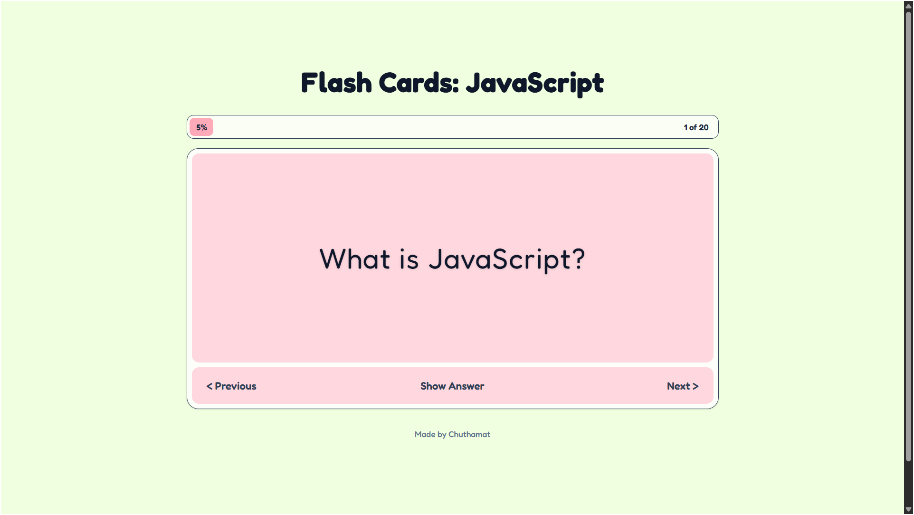
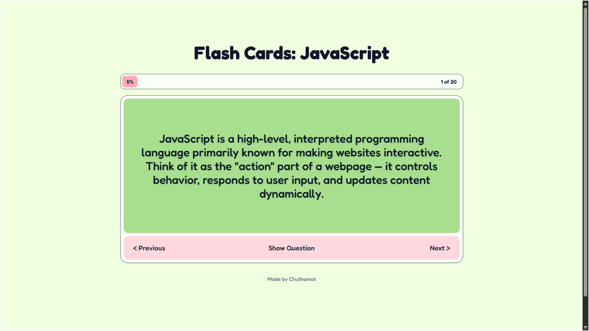
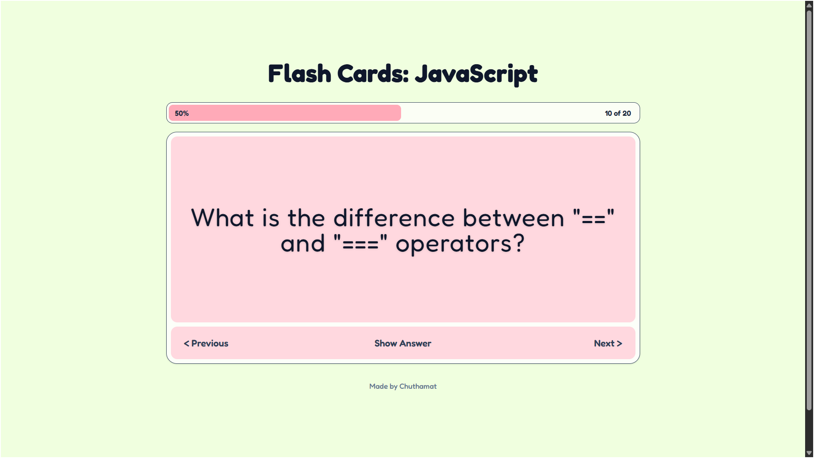
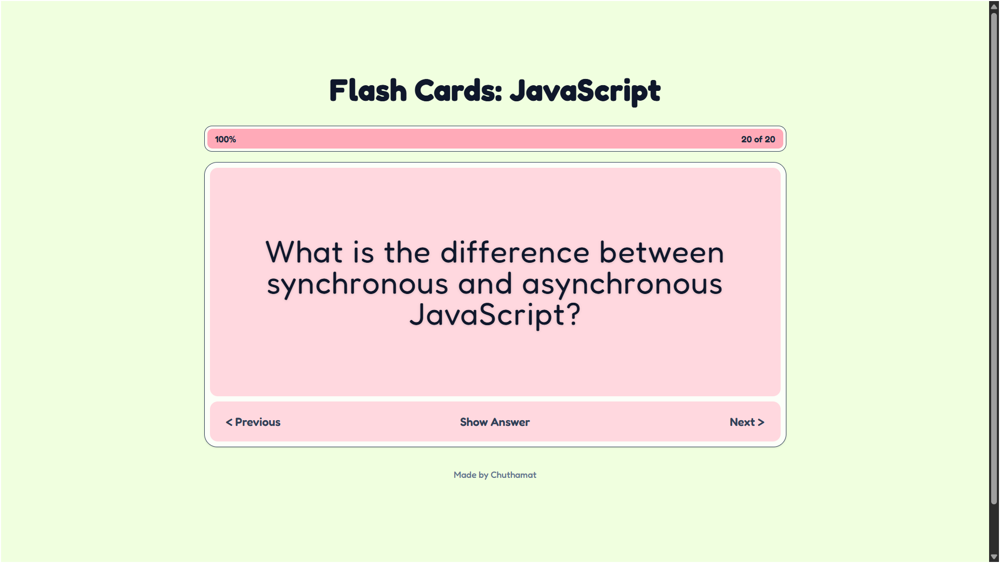

# Flash Cards

This is a solution to the ["Flash Cards" project on Roadmap.sh](https://roadmap.sh/projects/flash-cards).

Project URL: https://roadmap.sh/projects/flash-cards

## Previews

### Question View

### Answer View (Flipped)

### Progress

## Technologies Used

- **React** (Hooks, Functional Components)
- **Vite**
- **Tailwind CSS v4** (Custom theme configured)
- Google Fonts (`Pixelify Sans` & `Fredoka`)

## How to Run Locally

1. Clone or download the repository.
2. Run `npm install` to install dependencies.
3. Run `npm run dev` to start the development server.
